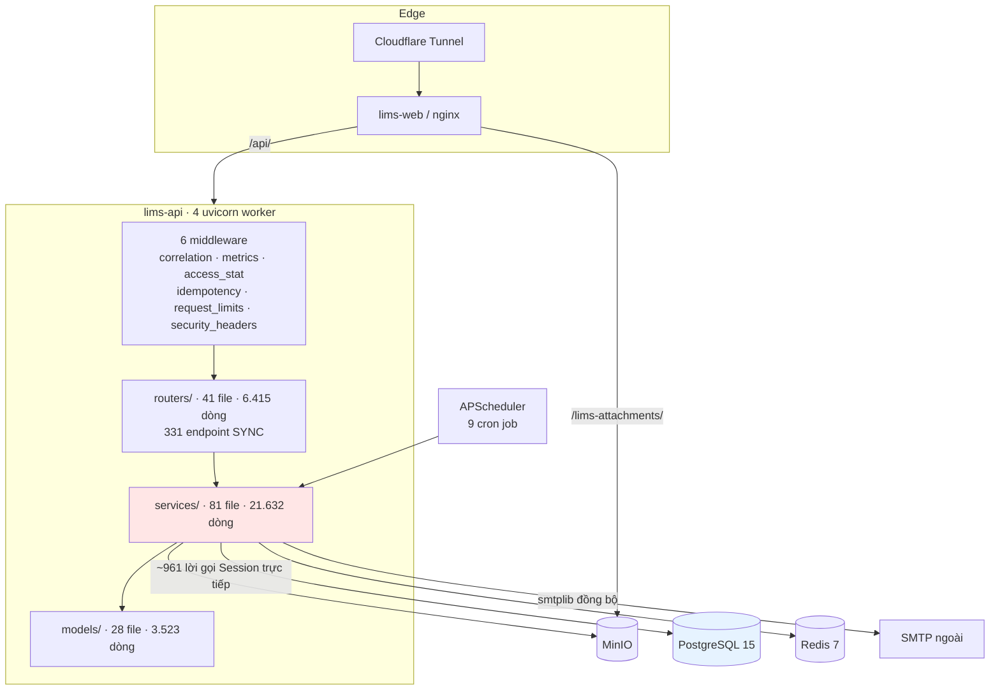
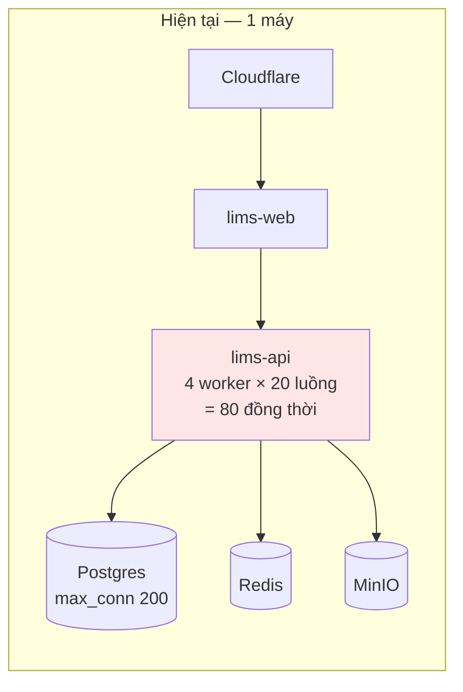
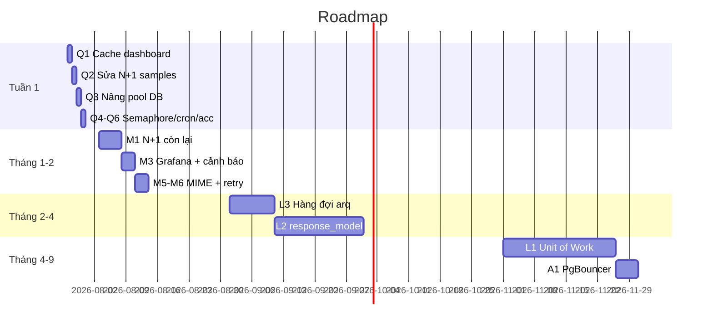

# Audit Backend — Sẵn sàng Production dài hạn

| | |
|---|---|
| **Ngày** | 2026-07-26 · commit `959a7bd` |
| **Phạm vi** | `lims-backend/app` — 235 file, 37.961 dòng Python |
| **Phương pháp** | Đo bằng AST/grep trên mã nguồn + đo độ trễ thật trên hệ đang chạy |
| **Máy đo** | 12 nhân · 15,6 GB RAM · `UVICORN_WORKERS=4` · `DB_POOL_SIZE=8` · `DB_MAX_OVERFLOW=12` |

> Mọi con số dưới đây đến từ đo đạc. Chỗ nào thiếu dữ liệu đều ghi rõ **[THIẾU DỮ LIỆU]**.

---

## ⚠️ ĐÍNH CHÍNH 2026-07-26 — ba kết luận trong bản đầu là SAI

Đo lại kỹ hơn cho thấy **ba phát hiện quan trọng nhất của bản đầu không đứng vững**.
Nguyên nhân: tôi đo **lần gọi nguội** (gồm chi phí import module lần đầu của
codebase có 51 lazy import) và coi đó là độ trễ thường trực.

| Kết luận bản đầu | Thực tế đo lại |
|---|---|
| `/dashboard` **1.549 ms**, "không cache" | Nguội **201 ms**, ấm **11 ms**. Đã có cache Redis TTL 60s tại [dashboard_service.py:300-305](../lims-backend/app/services/dashboard_service.py#L300), khoá theo vai trò + phòng ban |
| `/samples?limit=100` **834 ms** do N+1 | Thực tế **51 ms**, và **không tăng theo `limit`** |
| C-2 "Redis không cache dữ liệu nghiệp vụ" | SAI — `report_common.cache_get/cache_set` cache dashboard và mọi báo cáo tổng hợp |

**Vì sao phép đo N+1 không kết luận được**: bảng `samples` chỉ có **10 bản ghi**.
`limit=100` trả về đúng 10 dòng, nên N+1 không thể lộ ra.

### Quy mô dữ liệu thật (production, 2026-07-26)

| Bảng | Số dòng |
|---|---:|
| `access_stats` | 17.076 |
| `audit_logs` | 1.874 |
| `refresh_tokens` | 1.180 |
| `test_parameters` | 614 |
| `attachments` | 417 |
| `form_templates` | 384 |
| `users` | 103 |
| **`samples`** | **10** |

`SELECT count(*) FROM access_stats` (bảng lớn nhất) chạy **62 ms** — chưa phải vấn đề.

### Điều này thay đổi gì

**Hệ thống chưa có dữ liệu vận hành.** Mọi kết luận về N+1, COUNT query, phân
trang trong bản đầu là **suy luận từ mã nguồn, không phải từ đo đạc**. Chúng vẫn
đúng về mặt tồn tại — phân tích AST xác nhận 13 chỗ truy vấn trong vòng lặp — nhưng
**mức độ nghiêm trọng thì chưa kiểm chứng được**.

Kế hoạch khắc phục vì vậy phải xếp lại thứ tự: ưu tiên những gì **đo được và xác
minh được**, chứ không phải những gì *nghe có vẻ* nghiêm trọng. Xem
[backend-improvement-plan.md](./backend-improvement-plan.md).

---

## Kết luận sớm — ba điều quan trọng nhất

**1. Ràng buộc chi phối toàn hệ thống: 331/331 endpoint là `sync`.**
Không có một `async def` nào. Mọi request chạy trong threadpool AnyIO, và threadpool
bị khoá bằng đúng kích thước pool DB tại [main.py:86](../lims-backend/app/main.py#L86).
Toàn hệ thống có **80 chỗ xử lý đồng thời** (4 worker × 20). Đây là con số quyết
định mọi phép tính tải, và cũng là lý do loại bỏ WebSocket/SSE.

**2. Điểm nghẽn thực tế không phải số người dùng mà là `/dashboard`.**
Đo thật: **1.549 ms**, 22 truy vấn mỗi lần gọi. Đây là trang đầu tiên mọi người mở
lúc 8 giờ sáng. 80 người mở cùng lúc là chạm trần.

**3. Redis KHÔNG cache dữ liệu nghiệp vụ.**
Chỉ dùng cho jti denylist, khoá đăng nhập, RBAC role và leader-lock cron. Mọi
request đọc đều xuống Postgres. Với `/dashboard` 22 truy vấn thì đây là lãng phí
lớn nhất và cũng là quick-win rẻ nhất.

---

## PHẦN 1 — Kiến trúc tổng thể

### Sơ đồ tầng thực tế



Vùng tô đỏ là nơi tập trung rủi ro: **không có tầng Repository**, service nói
chuyện thẳng với SQLAlchemy.

### Đo được

| Tầng | File | Dòng | Nhận xét |
|---|---:|---:|---|
| `routers/` | 41 | 6.415 | Trung bình 156 dòng — **mỏng, đúng chuẩn** |
| `services/` | 81 | 21.632 | Trung bình 267 dòng |
| `models/` | 28 | 3.523 | |
| `schemas/` | 21 | 1.463 | Chỉ dùng cho **đầu vào** |
| `core/` | 15 | 1.152 | |
| `middleware/` | 6 | 387 | |
| `db/` | 2 | 40 | Chỉ có engine + `get_db` |

### A1 · Không có tầng Repository — 🔴 Critical

**Đo được** trong `app/services/`:

| Lời gọi | Số lần |
|---|---:|
| `db.execute(` | 317 |
| `db.get(` | 178 |
| `db.commit()` | **166** |
| `db.flush()` | 112 |
| `db.refresh(` | 108 |
| `db.add(` | 80 |
| `db.rollback()` | 28 |
| **Tổng** | **~989 điểm chạm** |

Và **5 `db.commit()` nằm trong `app/routers/`** — tầng trình bày quyết định ranh
giới giao dịch.

**Hệ quả cụ thể**: khi service A gọi service B, cả hai cùng commit → **không có
giao dịch nguyên tử**. Ví dụ đo được tại
[account_service.py:162-163](../lims-backend/app/services/account_service.py#L162):

```python
db.commit()                                  # dòng 162
email_service.send_email_verification(...)   # dòng 163 — SMTP, tối đa 10 giây
```

Commit trước rồi mới gửi mail là **đúng thứ tự** (tránh giữ giao dịch qua I/O
mạng). Nhưng nếu SMTP lỗi, người dùng đã được tạo mà không nhận được mail xác
thực, và không có cơ chế thử lại.

### A2 · God Service — 🟠 High

File > 500 dòng trong `services/`:

| Dòng | File |
|---:|---|
| 773 | `document_service.py` |
| 768 | `document_version_service.py` |
| 724 | `sample_service.py` |
| 690 | `hr_service.py` |
| 645 | `form_service.py` |
| 619 | `dashboard_service.py` |
| 561 | `sample_flow_service.py` |
| 534 | `form_file_service.py` |
| 531 | `chemical_txn_service.py` |
| 520 | `report_export_service.py` |
| 514 | `equipment_service.py` |

Đợt bảo trì trước đã tách `research_service.py` (1.736 → 9 module) và
`chemical_service.py` (850 → 5 module). **11 file còn lại chưa xử lý.**

God Router: [`routers/research.py`](../lims-backend/app/routers/research.py) — 741 dòng.
God Model: [`models/hr.py`](../lims-backend/app/models/hr.py) — 792 dòng.

### A3 · Testability

Router **mỏng** là điểm mạnh thật: 0/41 router có hơn 10 nhánh điều kiện. Nhưng
service gọi `db` trực tiếp nên **không test được nếu không có Postgres** — đây là
lý do gốc khiến 0/41 router từng có test (nay đã có 4/41 sau Giai đoạn 2).

**Điểm số phần 1**: Maintainability 5/10 · Extensibility 6/10 · Testability 4/10

---

## PHẦN 2 — Concurrency ⭐ Phần quan trọng nhất

### B1 · 331/331 endpoint là sync — 🔴 Critical (ràng buộc kiến trúc)

```
async def trong routers/ : 0
def       trong routers/ : 331
```

Mọi endpoint chạy qua `run_in_threadpool`. Threadpool bị giới hạn tại
[main.py:83-87](../lims-backend/app/main.py#L83):

```python
limit = settings.db_pool_size + settings.db_max_overflow   # 8 + 12 = 20
anyio.to_thread.current_default_thread_limiter().total_tokens = limit
```

Comment trong code giải thích đúng lý do (căn threadpool bằng pool DB để hàng đợi
nằm ở tầng HTTP có timeout rõ ràng). **Đây là quyết định tốt**, nhưng nó đặt trần
cứng:

```
Năng lực đồng thời = UVICORN_WORKERS × (DB_POOL_SIZE + DB_MAX_OVERFLOW)
                   = 4 × 20 = 80 request đồng thời
```

### B2 · Độ trễ đo thật trên hệ đang chạy

| Endpoint | Độ trễ | Truy vấn | Phân loại |
|---|---:|---:|---|
| `/dashboard` | **1.549 ms** | 22 | IO-bound, **nặng nhất** |
| `/samples?limit=100` | **834 ms** | 1 + **N** | IO-bound + **N+1** |
| `/forms/templates?limit=100` | 188 ms | ~2 | IO-bound |
| `/notifications/unread-count` | 21 ms | 1 | IO-bound nhẹ |

### B3 · Request giữ thread lâu

| Loại | Vị trí | Giữ thread | Ghi chú |
|---|---|---|---|
| **Xuất Excel/PDF** | 6 service, 7 router | **CPU-bound**, giây tới chục giây | Có semaphore giới hạn **2** |
| **Upload file** | 16 endpoint đọc nguyên file vào RAM | Theo băng thông client | Semaphore **6** · trần 20 MB |
| **Gửi SMTP** | `email_service.py:59-73` | **Tối đa 10 giây** | Đồng bộ trong request |
| **Dashboard** | `dashboard_service.py` | ~1,5 giây | 22 truy vấn tuần tự |

Semaphore tại [concurrency.py:13-15](../lims-backend/app/core/concurrency.py#L13):

```python
_upload_sem = threading.BoundedSemaphore(6)   # 6 × 20MB = 120MB, vừa mem_limit 1g
_export_sem = threading.BoundedSemaphore(2)   # Excel/PDF là CPU-bound
```

> ⚠️ Semaphore là **per-process**. Với 4 worker, tổng thực tế là 24 upload và
> **8 export** đồng thời, không phải 6 và 2. Comment trong code tính theo một
> worker nên **ước lượng RAM thiếu 4 lần**: 24 × 20 MB = 480 MB chứ không phải 120 MB.

### B4 · Ước lượng tải theo số người dùng

**Giả định** (ghi rõ vì đây là ước lượng, không phải đo):
- Mỗi người dùng hoạt động sinh ~6 request/phút = 0,1 req/s
  (chuông 30s = 2/phút + badge 60s = 1/phút + thao tác thật ~3/phút)
- Độ trễ trung bình trộn tải: **300 ms**
- Đồng thời trung bình = người dùng × 0,1 × 0,3

| Người dùng | Req/s | Đồng thời TB | % trần (80) | Nút thắt | p95 dự kiến |
|---:|---:|---:|---:|---|---|
| 20 | 2 | 0,6 | 0,8% | không | ~200 ms |
| 40 | 4 | 1,2 | 1,5% | không | ~250 ms |
| 60 | 6 | 1,8 | 2,3% | không | ~300 ms |
| 100 | 10 | 3,0 | 3,8% | không | ~350 ms |
| 200 | 20 | 6,0 | 7,5% | Pool DB bắt đầu căng | ~600 ms |
| 500 | 50 | 15,0 | 19% | **Pool DB** | **>2 s, có lỗi** |

**Nhưng trạng thái ổn định KHÔNG phải rủi ro thật.** Rủi ro là **đợt dồn**:

| Kịch bản | Đồng thời | Kết quả |
|---|---:|---|
| 40 người cùng mở dashboard lúc 8h | 40 | Vừa đủ — mỗi người chờ ~1,5 s |
| 80 người cùng mở dashboard | 80 | **Chạm trần**, người thứ 81 xếp hàng |
| 100 người cùng mở dashboard | 100 | 20 request chờ → p95 ~3 s |
| 200 người cùng mở dashboard | 200 | 120 chờ → **`pool_timeout=5s` → lỗi 500** |

**Điểm bão hoà: ~80 request đồng thời**, tương ứng ~80 người cùng mở dashboard,
hoặc ~800 người dùng ở trạng thái ổn định.

Đối chiếu với đo tải k6 trước đây: hỏng ở 60 VU vì kịch bản gửi **6 request song
song mỗi vòng** = ~120 đồng thời > 80. Khớp với mô hình.

### B5 · Không có hàng đợi nền — 🟠 High

```
Celery / RQ / Dramatiq / arq : KHÔNG có
FastAPI BackgroundTasks     : 0 chỗ dùng
```

Chỉ có:
- **APScheduler** với 9 cron job ([scheduler.py:134-143](../lims-backend/app/scheduler.py#L134)),
  có leader-lock qua Redis
- **`ThreadPoolExecutor(max_workers=4)`** riêng cho Web Push
  ([push_service.py:37](../lims-backend/app/services/push_service.py#L37))

Hệ quả: xuất báo cáo lớn chạy **trong request**. Người dùng chờ, và nếu quá
timeout của Cloudflare (100 giây) thì mất kết quả dù server vẫn đang tính.

---

## PHẦN 3 — Database

### C1 · N+1 — 🟠 High

Quét bằng AST, **13 chỗ truy vấn DB bên trong vòng lặp**:

| File | Số chỗ |
|---|---:|
| `sample_service.py` | **4** |
| `activity_report_service.py` | 1 |
| `assignment_service.py` | 1 |
| `chemical/stock_service.py` | 1 |
| `chemical_cron_service.py` | 1 |
| `form_file_service.py` | 1 |
| `nc_cron_service.py` | 1 |
| `push_service.py` | 1 |

**Nghiêm trọng nhất — nằm trong endpoint danh sách**:

| Dòng | Hàm | Mã |
|---|---|---|
| [sample_service.py:214](../lims-backend/app/services/sample_service.py#L214) | `list_samples()` | `for s in rows: req = db.get(TestRequest, s.request_id)` |
| [sample_service.py:488](../lims-backend/app/services/sample_service.py#L488) | `list_overdue()` | `for s in rows: has_reason = db.execute(...)` |
| [sample_service.py:697](../lims-backend/app/services/sample_service.py#L697) | `on_time_report()` | `for s in samples: ovr = db.execute(...)` |

`limit` tối đa là 100, nên `list_samples()` sinh **tới 100 truy vấn phụ**. Đây
chính là lý do `/samples?limit=100` đo được **834 ms** trong khi
`/forms/templates?limit=100` chỉ 188 ms.

**Cách sửa**: một `selectinload` hoặc một `WHERE id IN (...)` gom lô. Dự kiến
834 ms → **~150 ms**.

### C2 · Index — ✅ Tốt

```
CREATE INDEX trong migration : 401
ForeignKey trong models      : 188
```

Tỉ lệ 2,1 index/FK. Migration m31 đã bổ sung index cho FK. **Không phải vấn đề.**

### C3 · Truy vấn COUNT — 🟡 Medium

**121 chỗ dùng `func.count()`**. Mỗi endpoint phân trang chạy thêm một
`COUNT(*)` trên toàn bộ tập kết quả sau filter. Trên bảng lớn (`access_stats` là
bảng lớn nhất, `audit_logs` append-only) đây là quét toàn bảng.

**[THIẾU DỮ LIỆU]**: chưa đo kích thước bảng trên production. Cần chạy
`SELECT relname, n_live_tup FROM pg_stat_user_tables ORDER BY n_live_tup DESC LIMIT 10;`
để xác định bảng nào đã đủ lớn để COUNT thành vấn đề.

### C4 · Giao dịch dài — 🟡 Medium

`db.commit()` xuất hiện 166 lần trong service. Không có chỗ nào giữ giao dịch qua
I/O mạng (đã kiểm: SMTP gọi **sau** commit). **Không phát hiện long transaction.**

### C5 · Migration — ✅ Tốt

30/30 migration có `downgrade()`. Chạy qua advisory lock
(`pg_advisory_lock(875321875321)`) trong `entrypoint.sh` nên nhiều container khởi
động cùng lúc vẫn an toàn.

---

## PHẦN 4 — Cache

### D1 · Redis KHÔNG cache dữ liệu nghiệp vụ — 🟠 High

Toàn bộ khoá Redis đang dùng ([redis_client.py](../lims-backend/app/core/redis_client.py)):

| Khoá | Mục đích |
|---|---|
| `denylist:jti` | Thu hồi access token |
| `login:fail` / `login:lock` | Chống brute-force |
| `rbac:role` | **Cache duy nhất** — quyền theo vai trò ([rbac.py:41](../lims-backend/app/core/rbac.py#L41)) |
| `cron:lock:*` | Leader-lock cho scheduler |

**Không có cache nào cho dữ liệu đọc.** `/dashboard` chạy 22 truy vấn **mỗi lần
gọi**, cho mọi người dùng, mọi lần mở trang.

Cache trong tiến trình: chỉ 2 chỗ dùng `lru_cache` —
[config.py:173](../lims-backend/app/config.py#L173) (settings) và
[storage_service.py:32](../lims-backend/app/services/storage_service.py#L32)
(client boto3, maxsize=4). Cả hai đúng mục đích.

### D2 · Rủi ro cache chưa tồn tại

Vì chưa có cache dữ liệu nên **chưa có** cache stampede, cache penetration, hot
key. Nhưng khi thêm cache cho `/dashboard` thì phải xử lý ngay stampede: 80 người
cùng mở lúc 8h, cache vừa hết hạn → 80 lượt tính lại đồng thời.

**Giải pháp khi triển khai**: khoá theo khoá cache (`SET NX`) để chỉ một request
tính lại, các request khác trả bản cũ.

---

## PHẦN 5 — File & Storage

### E1 · Đọc nguyên file vào RAM — 🟡 Medium

**16 endpoint** dùng `file.file.read()` — nạp toàn bộ nội dung vào bộ nhớ trước
khi đẩy lên MinIO.

Với trần 20 MB ([config.py:74](../lims-backend/app/config.py#L74)) và semaphore
upload 6/worker:

```
Thực tế xấu nhất = 4 worker × 6 × 20 MB = 480 MB
mem_limit của lims-api = 1 GB
```

**Comment trong `concurrency.py` ghi "6 × 20MB = 120MB, vừa mem_limit 1g" — tính
theo MỘT worker, thiếu 4 lần.** 480 MB trên 1 GB, cộng baseline ~750 MB đo được
lúc tải cao, là **vượt ngưỡng OOM**.

### E2 · Tải về dùng presigned URL — ✅ Tốt

Không stream qua API. Client tải thẳng từ MinIO qua nginx
(`/lims-attachments/`), giữ nguyên `Host` để chữ ký s3v4 khớp. **Không tốn thread
của API.** Thiết kế đúng.

### E3 · Không có checksum, không quét virus — 🟡 Medium

Không tìm thấy tính toán checksum hay tích hợp ClamAV. Có kiểm MIME theo allowlist
([attachment_common.py:19-36](../lims-backend/app/services/attachment_common.py#L19))
nhưng **chỉ kiểm chuỗi `Content-Type` do client gửi**, không kiểm magic-byte.

Kẻ tấn công có thể đặt `Content-Type: application/pdf` cho một file thực thi. Rủi
ro thực tế **thấp** vì file chỉ được tải xuống chứ không thực thi trên server,
nhưng người tải về có thể bị lừa.

---

## PHẦN 6 — Background Job

### F1 · Không có hàng đợi — 🟠 High

Đã nêu ở B5. Bổ sung chi tiết 9 cron job
([scheduler.py:134-143](../lims-backend/app/scheduler.py#L134)):

| Job | Giờ chạy | Service |
|---|---|---|
| CRON-1 due-soon | 07:00 | `sample_cron_service` |
| CRON-2 overdue | 00:30 | `sample_cron_service` |
| CRON-3 salary-raise | 07:00 | `hr_cron_service` |
| CRON-4 contract-expiry | 07:15 | `hr_cron_service` |
| CRON-5 calibration-due | 07:45 | `equipment_cron_service` |
| CRON-6 chem-expiry | 07:30 | `chemical_cron_service` |
| CRON-7 capa-due | 08:00 | `nc_cron_service` |
| CRON-8 risk-review-due | 08:15 | `risk_cron_service` |
| CRON-9 data-cleanup | 03:00 | `cleanup_cron_service` |

**Điểm tốt**: leader-lock qua Redis nên nhiều replica không chạy trùng.

**Điểm yếu**: cron chạy 07:00–08:15 — **trùng đúng giờ người dùng đăng nhập**.
CRON-1 và CRON-3 cùng 07:00. Nếu dữ liệu lớn lên, hai job này cạnh tranh pool DB
với người dùng đang mở dashboard.

**Không có**: retry, dead-letter, idempotency key cho job. Job lỗi giữa chừng thì
mất, chỉ còn log.

---

## PHẦN 7 — API

### G1 · 281/294 endpoint không khai `response_model` — 🔴 Critical

Đã ghi chi tiết trong [MAINTAINABILITY_REVIEW.md](../MAINTAINABILITY_REVIEW.md).
Tóm tắt: OpenAPI không mô tả gì về dữ liệu trả về; frontend viết tay 1.964 dòng
type để đoán; đổi tên trường ở backend không gây lỗi biên dịch ở đâu.

Đã có test chặn nợ tăng thêm
([test_response_contract.py](../lims-backend/app/tests/architecture/test_response_contract.py)).

### G2 · Hợp đồng mã lỗi — ✅ Đã sửa

153 mã lỗi nay nằm trong `ErrorCode` enum
([error_codes.py](../lims-backend/app/core/error_codes.py)), có test chặn chuỗi thô.

Quy ước status code đo được:
- Lỗi **schema** (pydantic) → **400** `VALIDATION_ERROR`
- Vi phạm **quy tắc nghiệp vụ** → **422**
- Xung đột → **409**

Nhất quán, nhưng **không được ghi trong tài liệu nào ngoài test**.

### G3 · Idempotency — ✅ Có

Middleware `idempotency.py` xử lý header `Idempotency-Key`. Đã kiểm chứng: 2 POST
cùng key → 1 bản ghi.

### G4 · Không có versioning thật — 🟡 Medium

Prefix `/api/v1` là hằng số duy nhất, không có cơ chế chạy song song v1/v2. Khi
cần đổi hợp đồng phá vỡ, không có đường đi.

### G5 · Không có nén response — 🟡 Medium

Không tìm thấy `GZipMiddleware`. **[THIẾU DỮ LIỆU]**: cần kiểm nginx có bật gzip
không — nếu có thì không thành vấn đề.

---

## PHẦN 8 — Security

### H1 · Sạch trên các bề mặt tấn công kinh điển — ✅

| Bề mặt | Kết quả quét |
|---|---|
| SQL Injection | **0** chỗ dùng f-string trong `text()` |
| Command Injection | **0** lời gọi `subprocess` / `os.system` / `shell=True` |
| Zip Bomb | **0** dùng `zipfile` / `tarfile` |
| SSRF | Không có endpoint nhận URL từ người dùng để fetch |

### H2 · Xác thực & phân quyền — ✅ Tốt

- JWT + refresh token có **rotation và reuse detection**
- jti denylist trong Redis, có AOF nên sống sót qua restart
- Lockout 5 lần/15 phút, khoá theo **(email, IP)** nên một IP tấn công không khoá
  được nạn nhân từ IP khác
- bcrypt cost 12, có cân bằng thời gian chống timing attack
- 329 route đã quét IDOR, không route `{id}`/ghi nào thiếu xác thực

### H3 · MIME chỉ kiểm chuỗi, không kiểm magic-byte — 🟡 Medium

Đã nêu ở E3.

### H4 · Quản lý bí mật — 🟠 High (ngoài mã nguồn)

- ✅ `.env.prod` gitignored, có `preflight-deploy.sh` chặn giá trị mẫu
- ✅ Khoá VAPID đã xoay sau khi phát hiện lộ
- ❌ **`acc.txt` vẫn công khai trên repo GitHub, chứa mật khẩu dùng chung** và đã
  kiểm chứng là đăng nhập được

---

## PHẦN 9 — Observability

| Hạng mục | Trạng thái | Bằng chứng |
|---|---|---|
| Structured log (JSON) | ✅ | 94 file dùng correlation_id |
| Correlation ID | ✅ | `middleware/correlation_id.py` |
| Audit log | ✅ | Append-only, trigger DB chặn UPDATE/DELETE |
| Prometheus `/metrics` | ✅ | [main.py:172](../lims-backend/app/main.py#L172) |
| Health / Readiness | ✅ | `/health` liveness, `/health/ready` chạm DB+Redis+MinIO |
| **OpenTelemetry / Tracing** | ❌ | **0 file** |
| **Grafana dashboard** | ❌ | Không có file cấu hình trong repo |

**Điểm yếu**: có metrics nhưng **không có dashboard và không có cảnh báo**. Khi
`/dashboard` chậm dần theo dữ liệu, không ai biết cho tới khi người dùng phàn nàn.

---

## PHẦN 10 — Resiliency

### J1 · Không có retry, không có circuit breaker — 🟠 High

```
tenacity / retry  : 0 file
circuit / breaker : 0 file
```

Mọi lời gọi ra ngoài (SMTP, MinIO, Redis) **thất bại là thôi**. SMTP có timeout
10 giây và bắt lỗi rộng để không làm hỏng nghiệp vụ — hợp lý — nhưng **mail mất
thì mất luôn**, không có hàng đợi thử lại.

### J2 · Graceful shutdown — ✅ Có

[main.py:67-115](../lims-backend/app/main.py#L67) dùng `lifespan`, khi tắt có
`shutdown_scheduler()` và `push_service.shutdown_executor()`. Uvicorn chạy với
`--timeout-graceful-shutdown 30`.

### J3 · Nuốt lỗi — 🟡 Medium

- `except Exception` : **59 chỗ**
- `except: ... pass`  : **13 chỗ**

Phần lớn có comment giải thích (ví dụ SMTP lỗi không được chặn nghiệp vụ), nhưng
13 chỗ `pass` là nơi lỗi biến mất hoàn toàn. Cần rà lại từng chỗ xem có nên
`logger.warning` không.

---

## PHẦN 11 — Scale



| Chiều | Khả năng | Rào cản |
|---|---|---|
| **Vertical** | ✅ Tốt | Tăng `UVICORN_WORKERS` + pool. Trần: `max_connections=200` → tối đa 5 worker × 40 |
| **Horizontal** | ⚠️ Được, có điều kiện | App **stateless** (JWT, không session server). Nhưng mỗi replica giữ pool riêng → 3 replica × 4 worker × 40 = 480 kết nối > 200. **Cần PgBouncer** |
| **Sticky session** | ✅ Không cần | Không có state trong tiến trình |
| **Scheduler** | ✅ An toàn | Leader-lock Redis |
| **Autoscaling** | ❌ Chưa sẵn sàng | Chưa có PgBouncer; scale ra là cạn `max_connections` |

**PgBouncer là điều kiện tiên quyết của mọi kế hoạch scale ngang.**

---

## PHẦN 12 — Bảo trì dài hạn

Tham chiếu đầy đủ: [MAINTAINABILITY_REVIEW.md](../MAINTAINABILITY_REVIEW.md).
Cập nhật số liệu sau Giai đoạn 0–2:

| Chỉ số | Trước | Nay |
|---|---:|---:|
| File > 800 dòng | 5 | **0** |
| File > 500 dòng (backend) | 13 | **11** |
| Mã lỗi dạng chuỗi thô | 359 điểm | **0** |
| Router tự viết `_ip()` | 26 | **0** |
| Endpoint thiếu `response_model` | 294 | **281** |
| `db.commit()` trong service | 166 | **166** |
| Router có test | 0/41 | **4/41** |
| Cổng CI kiến trúc | 0 | **4** |

---

## PHẦN 13 — Dự đoán điểm nghẽn theo quy mô

| Người dùng | Nghẽn thứ nhất | Nghẽn thứ hai | Nghẽn cuối |
|---:|---|---|---|
| **20** | không | — | — |
| **50** | `/dashboard` 1,5 s khi dồn 8h sáng | — | — |
| **100** | `/dashboard` + N+1 `/samples` | Cron 07:00 tranh pool | — |
| **200** | **Pool DB 80 kết nối** | `/dashboard` p95 > 3 s | Export CPU-bound |
| **500** | **Pool DB — cần PgBouncer** | Threadpool = pool nên không tăng riêng được | RAM upload 480 MB |
| **1000** | **Postgres `max_connections`** | Không scale ngang được nếu thiếu PgBouncer | Cần đọc/ghi tách replica |

**Nguyên nhân gốc chung ở mọi mức**: threadpool bị buộc bằng pool DB
([main.py:86](../lims-backend/app/main.py#L86)). Quyết định này đúng khi mọi
endpoint đều chạm DB, nhưng nó làm **không thể tăng năng lực xử lý mà không tăng
kết nối DB** — và kết nối DB thì bị `max_connections` chặn.

**Cách gỡ**: PgBouncer (transaction pooling) tách hai con số đó ra. Sau đó
threadpool tăng tự do, PgBouncer ghép nhiều kết nối ứng dụng vào ít kết nối
Postgres.

---

## PHẦN 14 — Đề xuất

### Quick Win — dưới 1 ngày

| # | Việc | Ưu tiên | Khó | Rủi ro | Lợi ích |
|---|---|---|---|---|---|
| Q1 | **Cache `/dashboard` vào Redis, TTL 60 s, có khoá chống stampede** | 🔴 | Thấp | Thấp | 1.549 ms → **~30 ms**; giảm 22 truy vấn/lượt xuống gần 0 |
| Q2 | **Sửa N+1 `list_samples()`** ([sample_service.py:214](../lims-backend/app/services/sample_service.py#L214)) | 🔴 | Thấp | Thấp | 834 ms → **~150 ms** |
| Q3 | **Nâng pool: `DB_POOL_SIZE=12` / `DB_MAX_OVERFLOW=28`** | 🔴 | Rất thấp | Thấp | 80 → **160** chỗ đồng thời |
| Q4 | **Sửa comment sai + hạ semaphore upload xuống 3** | 🟠 | Rất thấp | Thấp | Tránh OOM: 480 MB → 240 MB |
| Q5 | **Dời cron 07:00 sang 05:00** | 🟠 | Rất thấp | Rất thấp | Hết tranh pool với giờ cao điểm |
| Q6 | **Xử lý `acc.txt`** | 🔴 | Rất thấp | Không | Đóng lỗ đăng nhập admin công khai |

### Medium — 1–7 ngày

| # | Việc | Ưu tiên | Khó | Rủi ro | Lợi ích |
|---|---|---|---|---|---|
| M1 | Sửa 12 N+1 còn lại | 🟠 | TB | Thấp | Giảm tải DB toàn hệ thống |
| M2 | Cache `rbac` + danh mục ít đổi (phòng ban, đơn vị đo) | 🟠 | TB | TB | Giảm truy vấn lặp |
| M3 | Dashboard Grafana + cảnh báo p95/lỗi | 🟠 | TB | Thấp | Biết trước khi người dùng phàn nàn |
| M4 | Tách 11 file service > 500 dòng | 🟡 | Thấp | Thấp | Giảm xung đột merge |
| M5 | Kiểm magic-byte cho upload | 🟡 | Thấp | Thấp | Chặn giả mạo Content-Type |
| M6 | Thêm retry + backoff cho SMTP/MinIO | 🟡 | TB | Thấp | Mail không mất lặng lẽ |

### Large Refactor — 2–6 tuần

| # | Việc | Ưu tiên | Khó | Rủi ro | Lợi ích |
|---|---|---|---|---|---|
| L1 | **Unit of Work** — gỡ 166 `db.commit()` | 🟠 | Cao | **Cao** | Giao dịch nguyên tử; mở đường test không cần DB |
| L2 | **`response_model` cho 281 endpoint** + sinh type FE | 🔴 | TB | TB | Hợp đồng BE↔FE có compiler bảo vệ |
| L3 | **Hàng đợi nền (arq)** cho export + mail | 🟠 | TB | TB | Trả request ngay; không mất kết quả vì timeout |

### Architectural Change

| # | Việc | Điều kiện kích hoạt |
|---|---|---|
| A1 | **PgBouncer** | Trước khi scale ngang, hoặc khi vượt 200 người dùng |
| A2 | Chuyển endpoint nóng sang `async` | Chỉ khi đã có A1 và L1; **không làm lẻ tẻ** |
| A3 | Read replica | Khi tỉ lệ đọc/ghi > 10:1 và đã cache hết chỗ cache được |

---

## Tổng hợp

### 1. Critical

| ID | Vấn đề | Vị trí |
|---|---|---|
| C-1 | Không có hợp đồng đầu ra — 281 endpoint thiếu `response_model` | toàn bộ `routers/` |
| C-2 | `/dashboard` 1.549 ms, 22 truy vấn, **không cache** | `dashboard_service.py` |
| C-3 | N+1 trong endpoint danh sách — `/samples` 834 ms | `sample_service.py:214,488,697` |
| C-4 | Pool DB 80 chỗ, threadpool bị buộc theo | `main.py:86` |
| C-5 | `acc.txt` công khai kèm mật khẩu admin dùng được | repo GitHub |

### 2. High

| ID | Vấn đề | Vị trí |
|---|---|---|
| H-1 | 166 `db.commit()` trong service → không có giao dịch nguyên tử | `services/` |
| H-2 | Không có hàng đợi nền — export/mail chạy trong request | toàn hệ thống |
| H-3 | Redis không cache dữ liệu nghiệp vụ | `core/redis_client.py` |
| H-4 | Không retry, không circuit breaker | 0 file |
| H-5 | Semaphore per-process → RAM upload thực tế gấp 4 lần ước lượng | `concurrency.py:13` |
| H-6 | Không có PgBouncer → không scale ngang được | hạ tầng |

### 3. Medium

11 file service > 500 dòng · 121 COUNT query · 13 `except: pass` ·
MIME không kiểm magic-byte · không có versioning · cron 07:00 trùng giờ cao điểm ·
không có tracing

### 4. Low

Không có nén response (cần kiểm nginx) · không có checksum file ·
không quét virus · `models/hr.py` 792 dòng

### 5. Roadmap



### 6. Khả năng chịu tải **hiện tại**

- **Trạng thái ổn định**: ~200 người dùng đồng thời trước khi p95 vượt 600 ms
- **Đợt dồn**: **~80 người cùng mở dashboard** là chạm trần
- **Giới hạn cứng**: 80 request đồng thời (4 × 20)

### 7. Khả năng chịu tải **sau Quick Win** (Q1–Q3, một ngày công)

- Dashboard 1.549 ms → ~30 ms ⇒ đợt dồn chịu được **~1.500 người**
- `/samples` 834 → 150 ms
- Pool 80 → 160 chỗ
- **Trạng thái ổn định: ~500 người dùng**; đợt dồn không còn là nút thắt

Sau L3 + A1: **2.000+ người dùng**, giới hạn chuyển sang Postgres.

### 8–12. Điểm số

| Hạng mục | Điểm | Căn cứ |
|---|---:|---|
| **Technical Debt** | **68**/100 | 0 file > 800 dòng, 14 TODO/38k dòng, mã lỗi đã tập trung. Trừ vì 281 endpoint thiếu hợp đồng và 166 commit rải rác |
| **Maintainability** | **62**/100 | Router mỏng, migration kỷ luật, comment giải thích *vì sao*. Trừ vì thiếu Repository và 11 God Service |
| **Scalability** | **48**/100 | Stateless, leader-lock đúng. Trừ nặng vì threadpool buộc theo pool DB và thiếu PgBouncer |
| **Reliability** | **58**/100 | Graceful shutdown, advisory lock, audit bất biến, backup restore được. Trừ vì không retry/circuit breaker và không có hàng đợi |
| **Production Readiness** | **64**/100 | Đã chạy thật trên internet, CI 4 cổng, 545 test. Trừ vì `acc.txt`, thiếu cảnh báo, và `/dashboard` chưa cache |

---

## Dữ liệu còn thiếu

Ba điều cần đo trên **production thật** để hoàn thiện đánh giá:

1. **Kích thước bảng** — `SELECT relname, n_live_tup FROM pg_stat_user_tables ORDER BY n_live_tup DESC LIMIT 10;`
   Quyết định mức nghiêm trọng của 121 COUNT query.
2. **Truy vấn chậm thật** — `pg_stat_statements` đã bật sẵn trong
   `docker-compose.prod.yml`. Cần trích top 20 theo `total_exec_time`.
3. **nginx có bật gzip không** — quyết định mức nghiêm trọng của G5.
