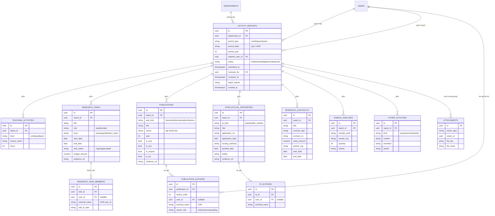

# Thiết kế hệ thống Web thay thế Google Form "Báo cáo hoạt động Viện NC CNSH & Môi trường (theo kỳ)"

Vai trò: Senior BA + Solution Architect + UX. Phân tích 10 trang form → nghiệp vụ → chuẩn
hoá dữ liệu → CSDL (ERD) → API → UI. **Form này = phiên bản báo-cáo-theo-kỳ của module M4
(NCKH) đã có** — phần lớn thực thể tái dùng bảng hiện tại, bổ sung thực thể gói **BÁO CÁO KỲ**
(`activity_reports`) + quy trình **nộp/duyệt**.

---

## 1. Phân tích Google Form (theo section)

Ký hiệu cột: **Bắt buộc** · **Tự sinh** (server sinh, không cho nhập) · **Không nên nhập**
(người dùng không nhập tay — suy ra từ dữ liệu hoặc từ tài khoản).

### PHẦN 0 — Metadata báo cáo (trang 1–3)
| Trường | Kiểu | Bắt buộc | Ghi chú thiết kế |
|---|---|---|---|
| Người nộp (email) | auto | ✓ | **Không nên nhập** — lấy từ tài khoản đăng nhập, không gõ email |
| Kỳ báo cáo | enum | ✓ | Form ghi "THÁNG" nhưng lựa chọn là **Quý** (Quý I–IV.2026) → **mâu thuẫn** (xem giả định A1). Chuẩn hoá `period_type` + `period_label` |
| Tên phòng nghiên cứu | ref (dropdown) | ✓ | = `departments` (đơn vị/lab). **Không nên nhập tự do** — chọn từ danh mục |

### PHẦN 2 — Hoạt động đào tạo (trang 4)
| Trường | Kiểu | Bắt buộc | Ghi chú |
|---|---|---|---|
| Số môn giảng dạy (ĐH) | int | — | **Tự sinh** — đếm từ danh sách, KHÔNG cho nhập tay (chống lệch số) |
| Danh mục môn ĐH | list | — | Mỗi môn 1 dòng: `Tên môn – Số tiết` → bảng con `teaching_activities` |
| Số môn giảng dạy (SĐH) | int | — | **Tự sinh** |
| Danh mục môn SĐH | list | — | như trên, thêm cờ `level = undergrad/grad` |

### PHẦN 3 — NCKH: Nhiệm vụ KHCN (trang 5)
| Trường | Kiểu | Ghi chú |
|---|---|---|
| Số lượng nhiệm vụ | int | **Tự sinh** |
| Danh mục nhiệm vụ | list | Mỗi dòng: `Tên – Chủ nhiệm/Tham gia – Cấp(Bộ/Sở/Ngành) – Thời gian – Tình trạng(đang/đã nghiệm thu) – Kinh phí – link` → `research_tasks` |

### PHẦN 4 — NCKH: Công bố khoa học (trang 6)
| Trường | Kiểu | Ghi chú |
|---|---|---|
| SL công bố trong nước / quốc tế / hội nghị | int×3 | **Tự sinh** |
| Danh mục trong nước | list | `Tên – tác giả/đồng tác giả – tạp chí – thời gian – link` |
| Danh mục quốc tế | list | thêm `Thuộc CSDL: SCIE/SSCI, Scopus, ACI` |
| Danh mục hội nghị/kỷ yếu | list | `Tên – HN/HT/kỷ yếu – tác giả – năm – link` |
→ 1 bảng `publications` với `pub_kind ∈ {domestic, international, conference}` + `publication_authors`.

### PHẦN 5 — NCKH: Sáng chế / Giải pháp hữu ích (trang 7)
| Trường | Kiểu | Ghi chú |
|---|---|---|
| SL bằng sáng chế / SL GPHI | int×2 | **Tự sinh** |
| Danh mục sáng chế / GPHI | list | `Tên – Số đơn,ngày nộp – Cơ quan cấp – Ngày cấp – Chủ bằng – Tác giả – link` → `intellectual_properties` với `ip_kind ∈ {patent, utility_solution}` |

### PHẦN 6 — NCKH: Hợp đồng KHCN (trang 8)
| Trường | Kiểu | Ghi chú |
|---|---|---|
| SL hợp đồng | int | **Tự sinh** |
| Danh mục hợp đồng | list | `Tên – Loại – Số HĐ – Giá trị – Đơn vị phối hợp – Thời gian` → `research_contracts` |

### PHẦN 7 — Phục vụ cộng đồng: Phân tích mẫu (trang 9)
| Trường | Kiểu | Ghi chú |
|---|---|---|
| Số lượng mã mẫu | int | **Tự sinh** |
| Danh sách mẫu | list | `Mã mẫu – Đơn vị gửi – Số lượng – Chỉ tiêu` → `sample_analyses`. **BA lưu ý:** đây thực chất là nghiệp vụ **M1/M2 (mẫu)** — nên tổng hợp read-only từ M1 thay vì nhập lại (xem §6) |

### PHẦN 8 — Công tác khác (trang 10)
| Trường | Kiểu | Ghi chú |
|---|---|---|
| Công tác Công đoàn | list | `Tên hoạt động – thành viên – giải thưởng` |
| Công tác Đảng | text | → `other_activities` với `kind ∈ {party, union, vilas, other}` |

**Trường tự sinh / không cho nhập (tổng hợp):** người nộp (từ auth), toàn bộ "Số lượng X"
(đếm từ danh sách), mã báo cáo, trạng thái duyệt, thời điểm nộp/duyệt, người duyệt.

---

## 2. Phân tích nghiệp vụ (workflow + vai trò)

**Quy trình thực tế (suy luận):**
1. **Trưởng phòng lab / Giảng viên** tạo báo cáo cho **1 kỳ** (quý/tháng) của **phòng mình** → điền các hoạt động (đào tạo, NCKH, phục vụ CĐ, công tác khác) → lưu **nháp** → **Nộp**.
2. **Văn phòng** tổng hợp: xem tất cả báo cáo các phòng theo kỳ, đối chiếu, xuất Excel/PDF tổng hợp cả năm.
3. **Lãnh đạo (Viện trưởng)** xem **dashboard** thống kê chéo (số công bố, đề tài, kinh phí… theo phòng/kỳ) và **duyệt** báo cáo.
4. **KTV** không tham gia báo cáo NCKH (chỉ vận hành thử nghiệm).
5. **Admin** cấu hình danh mục (phòng, kỳ báo cáo, cấp đề tài, chỉ mục tạp chí).

**Trạng thái báo cáo (state machine):** `draft → submitted → approved` (hoặc `submitted → rejected → draft` để sửa lại). Sau khi `approved` thì **khoá** (muốn sửa phải mở lại — `reopen`).

**Sửa sau khi nộp?** — Có: khi `submitted` mà chưa duyệt, người nộp (hoặc văn phòng) được sửa; khi `approved` phải `reopen` (ghi audit). **Cần duyệt?** — Có, theo mô hình báo cáo hành chính.

**Giả định (ghi rõ, cần KH xác nhận):**
- **A1:** Kỳ báo cáo là **Quý** (dữ liệu lựa chọn là Quý I–IV) dù tiêu đề ghi "THÁNG" → dùng `period_type` cấu hình được (`month|quarter|year`), mặc định `quarter`.
- **A2:** Mỗi (phòng × kỳ) chỉ có **1** báo cáo (unique) — tránh trùng.
- **A3:** "Số lượng X" **không nhập tay** mà đếm tự động — nếu KH muốn giữ ô nhập, coi đó là số "kê khai" và cảnh báo khi lệch với danh sách.
- **A4:** Phần "Phân tích mẫu" tổng hợp read-only từ M1 (không nhập lại) — nếu KH muốn nhập tay, giữ bảng `sample_analyses`.

---

## 3. Chuẩn hoá dữ liệu — vì sao KHÔNG "mỗi câu = 1 cột"

Google Form gom mọi thứ vào text tự do (`Tên – A – B – C`). Nếu bê nguyên thành cột sẽ:
sai chuẩn 1NF (nhiều giá trị/ô), không lọc/thống kê được (đếm SCIE, tổng kinh phí…), không
xuất báo cáo cấu trúc. **Chuẩn hoá quan hệ:**

- **Tách bảng con theo loại hoạt động** (mỗi dòng danh mục = 1 record): `teaching_activities`,
  `research_tasks`, `publications`, `intellectual_properties`, `research_contracts`,
  `sample_analyses`, `other_activities`.
- **Quan hệ n-n người tham gia** tách riêng (`publication_authors`, `research_task_members`) —
  cho phép người ngoài hệ thống (`external_name`) như hệ thống hiện tại đã làm.
- **"Số lượng X" là dữ liệu dẫn xuất** (COUNT) → **không lưu**, tính khi đọc.
- **Minh chứng** tách bảng `attachments` polymorphic (link/file) — mọi loại dùng chung.
- **Danh mục** (phòng, cấp đề tài, chỉ mục tạp chí, loại HĐ) tách bảng lookup — không hardcode.

---

## 4. Thiết kế CSDL

**Thực thể chính:** `activity_reports` (báo cáo kỳ — thực thể GÓI) 1—N với từng bảng hoạt động.
Mỗi hoạt động `report_id` (FK) + `department_id` (denormalize để lọc nhanh).

### Mermaid ERD

**Cardinality tóm tắt:** DEPARTMENT 1—N REPORT; REPORT 1—N mỗi bảng hoạt động; TASK/PUBLICATION/IP
1—N bảng người tham gia (n-n qua bảng nối, cho phép người ngoài HT); REPORT/hoạt động 1—N ATTACHMENTS.

**Ràng buộc chính:** `UNIQUE(department_id, period_type, period_label)` (A2); CHECK status;
CHECK XOR (`user_id` ⊕ `external_name`) ở các bảng người tham gia; `budget/value ≥ 0`.

---

## 5. Thiết kế REST API

| Method + Path | Chức năng |
|---|---|
| `GET /activity-reports?period=&department_id=&status=` | Danh sách báo cáo (lọc kỳ/phòng/trạng thái, phân trang). Scope: phòng lab thấy phòng mình; văn phòng/lãnh đạo/admin thấy tất cả |
| `POST /activity-reports` | Tạo báo cáo kỳ mới (draft) cho 1 phòng × kỳ (chặn trùng) |
| `GET /activity-reports/{id}` | Chi tiết 1 báo cáo + tất cả hoạt động con + số lượng dẫn xuất |
| `PUT /activity-reports/{id}` | Sửa metadata báo cáo (chỉ khi draft/submitted-chưa duyệt) |
| `POST /activity-reports/{id}/submit` | Nộp báo cáo: `draft → submitted` (khoá chỉnh sửa một phần) |
| `POST /activity-reports/{id}/approve` | Duyệt: `submitted → approved` (lãnh đạo/văn phòng) |
| `POST /activity-reports/{id}/reject` | Trả lại: `submitted → rejected` + lý do |
| `POST /activity-reports/{id}/reopen` | Mở lại báo cáo đã duyệt để sửa (audit) |
| `POST /activity-reports/{id}/teaching` … `/publications` … `/contracts` … | Thêm 1 dòng hoạt động vào báo cáo (mỗi loại 1 endpoint con) |
| `PATCH /teaching-activities/{id}`, `DELETE …` | Sửa/xóa 1 dòng hoạt động (tương tự cho mọi loại) |
| `POST /activity-reports/{id}/attachments` | Upload/gắn minh chứng |
| `GET /admin/activity-reports?period=` | Bảng tổng hợp toàn viện (văn phòng/lãnh đạo) |
| `GET /activity-reports/dashboard?period=&year=` | Thống kê chéo: tổng công bố (SCIE/Scopus…), đề tài, kinh phí, giờ giảng theo phòng/kỳ |
| `GET /activity-reports/export?format=xlsx\|pdf&period=` | Xuất báo cáo tổng hợp (kỳ hoặc cả năm), có RBAC scope |

**Chuẩn dùng lại hạ tầng đã có:** Idempotency-Key khi tạo/submit; `le=100` phân trang;
response-envelope `{success,data,meta}`; audit mọi thao tác submit/approve/reject.

---

## 6. Thiết kế UI (theo vai trò)

**Chung — Danh sách báo cáo:** bảng lọc theo Kỳ / Phòng / Trạng thái; badge trạng thái
(Nháp/Đã nộp/Đã duyệt/Trả lại); nút "Tạo báo cáo kỳ".

### Trưởng phòng lab / Giảng viên (người nộp)
- **Form nhập nhiều tab** theo section form gốc: Đào tạo · Nhiệm vụ KHCN · Công bố · Sáng chế/GPHI · Hợp đồng · Phân tích mẫu · Công tác khác.
- Mỗi tab là **bảng thêm-dòng** (không phải 1 ô text): nhập cấu trúc từng trường, "Số lượng" hiển thị **tự đếm** (read-only).
- Nút **Lưu nháp** / **Nộp**; sau khi nộp → chuyển read-only, chỉ sửa khi bị trả lại.
- Gắn link/tệp minh chứng cho từng dòng.

### Văn phòng (tổng hợp)
- **Bảng tổng hợp toàn viện** theo kỳ (mọi phòng), lọc + tìm; xem chi tiết từng báo cáo.
- **Xuất Excel/PDF** tổng hợp kỳ hoặc cả năm; đối chiếu số liệu.
- Được **sửa/nhắc** phòng chưa nộp; quản lý các mục hành chính (hợp đồng, công tác khác, chứng nhận).

### Lãnh đạo (Viện trưởng)
- **Dashboard**: thẻ KPI (tổng đề tài/công bố/kinh phí/giờ giảng), biểu đồ theo phòng & theo kỳ, tỉ lệ phòng đã nộp.
- **Duyệt/Trả lại** báo cáo; xem chi tiết read-only.

### KTV
- Không thấy menu báo cáo NCKH (đúng phân quyền hiện tại — chỉ vận hành thử nghiệm).

### Admin
- Cấu hình **danh mục**: phòng nghiên cứu, kỳ báo cáo (mở/đóng kỳ), cấp đề tài, chỉ mục tạp chí, loại hợp đồng; quản lý tài khoản & phân quyền.

---

## 7. Ánh xạ vào hệ thống HIỆN TẠI (tái dùng tối đa)

| Thực thể form | Hiện có (M4) | Cần thêm |
|---|---|---|
| Nhiệm vụ KHCN | `research_projects` + `project_members` | +`report_id`, +`role(lead/member)`, +`task_status` |
| Công bố (3 loại) | `publications` (+`pub_scope`, cờ chỉ mục, `conference`) + `publication_authors` | +`report_id`; đã có gần đủ |
| Sáng chế/GPHI | `publications` type=`patent` (+application/granted/holder) | +`utility_solution`; đã có gần đủ |
| Hợp đồng | `research_contracts` | +`report_id`, +`contract_no` |
| Giảng dạy | `teaching_courses` (+số tiết) | +`report_id`, +`level(ĐH/SĐH)` |
| Công tác khác | `staff_activities` | +`report_id` |
| Phân tích mẫu | **M1 (samples)** | tổng hợp read-only (A4) |
| **Báo cáo kỳ** | ❌ **CHƯA CÓ** | **model mới `activity_reports`** + workflow submit/approve |

> **Kết luận kiến trúc:** ~80% bảng đã có. Việc chính là (1) thêm thực thể **`activity_reports`**
> (gói theo kỳ + trạng thái), (2) gắn `report_id` vào các bảng hoạt động, (3) chuyển "Số lượng X"
> sang **dẫn xuất**, (4) thêm **workflow nộp/duyệt** + **dashboard/export tổng hợp**.

## 8. Lộ trình triển khai đề xuất
1. **P1** — model `activity_reports` + migration (period, status, unique phòng×kỳ) + gắn `report_id` vào các bảng hoạt động (nullable để tương thích dữ liệu cũ).
2. **P2** — Service/API: CRUD báo cáo + submit/approve/reject/reopen + endpoint thêm dòng hoạt động; "Số lượng" dẫn xuất.
3. **P3** — RBAC: người nộp (trưởng phòng/giảng viên) scope phòng; văn phòng/lãnh đạo toàn viện; KTV loại trừ.
4. **P4** — UI: form nhiều tab (người nộp), bảng tổng hợp (văn phòng), dashboard + duyệt (lãnh đạo).
5. **P5** — Export Excel/PDF tổng hợp kỳ/năm; tổng hợp mẫu read-only từ M1.
6. **P6** — Test (state machine, unique, RBAC) + import dữ liệu Excel năm 2024-2025 vào khung báo cáo.
